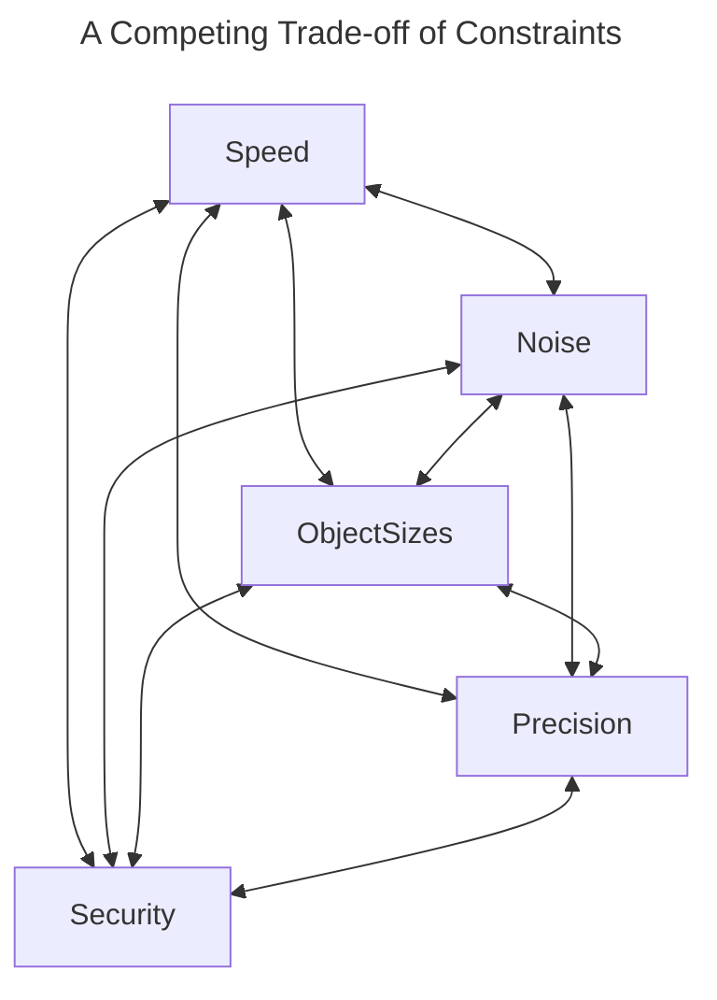
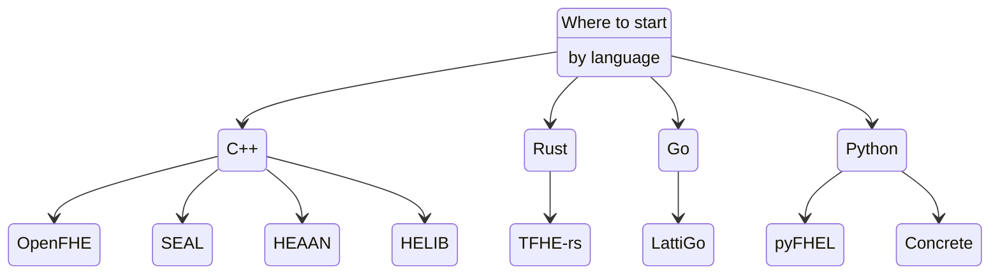
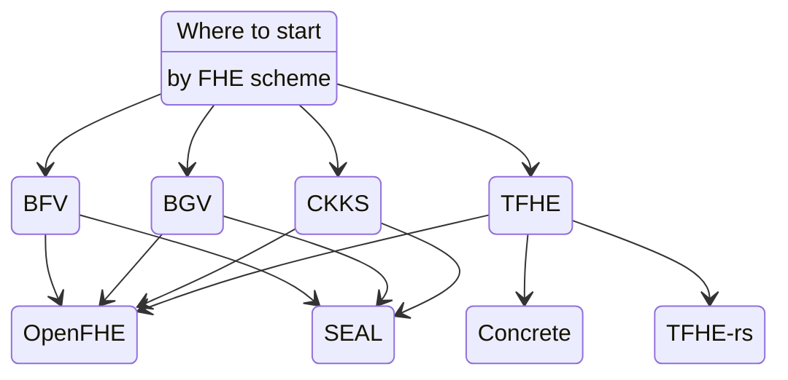

<!-- Main header navigation -->

   
  <a href="https://fhe-org.github.io">Home</a> | <a href="https://fhe-org.github.io/resources">Resources</a> | <a href="https://fhe-org.github.io/meetups/">Meetups</a> | <a href="https://fhe-org.github.io/conferences/conference-2024/">Conference 2024</a> | <a href="https://fhe-org.github.io/community">Join the community</a>

<!-- /Main header navigation -->

## Learner Track: Developer 

This learner track assumes you are a developer wanting to learn about FHE. To see other available Learner Tracks, <a href="../">click here</a>.

## Table of Contents

- #### [Generalities](#generalities)
  - Ideal Use Cases
  - Threat Model
- #### [Constraints](#constraints-1)
  - Object Sizes
  - Speed
  - Precision
    - Input Precision
    - Output Precision
  - Noise and Bootstrapping
  - Approximation vs Exact Computation
- #### [Schemes and Libraries](#schemes-and-libraries-1)
  - Table of Libraries
- #### [Get Started Coding](#start-coding)
  - Working Examples

 
 

# Generalities

Fully homomorphic encryption (FHE) allows you to run computations on encrypted data without decrypting it first. As a developer, this means you’re able to write code that doesn’t jeopardize the privacy of your users.

Benefits of using FHE in your applications as a developer can include:

- Demonstrating a commitment to data privacy and security to your users, and enhancing user trust in your application.
- Improving security by performing computations on cloud data without exposing to potential threats or unauthorized access.
- Ensuring that sensitive data remains protected even when third-party sharing is a required property of your application
- Complying with privacy regulations and standards by default

 

## Ideal Use Cases

Homomorphic encryption is ideal for some use cases more than others.

 

### Cloud / Distributed Computing

<table>

<tr>
<td colspan=2>
FHE enables secure computations on encrypted data stored in the cloud without the need to decrypt it. This preserves the confidentiality of sensitive data even when processed by third-party cloud service providers.
</td>
</tr>

<tr>
<td>Working Examples</td>
<td markdown="1">

- [Lattigo-polls: schedule meeting using Lattigo](https://github.com/ldsec/lattigo-polls-demo) by **Lattigo** on **Sep 2, 2022**

</td>
</tr>

<tr>
<td>More Reading</td>
<td>

</td>
</tr>
</table>

 

### Data Analysis and Actions

<table>

<tr>
<td colspan=2>
FHE allows for analysis and performing actions on encrypted data without revealing the actual content analysts. For instance, healthcare providers can conduct statistical analysis on confidential patient information without decrypting it, thus maintaining patient privacy.
</td>
</tr>

<tr>
<td>Working Examples</td>
<td markdown="1">

- [Encrypted image filtering](https://huggingface.co/spaces/zama-fhe/encrypted_image_filtering) by **Zama** on **Feb 23, 2023**
- [Sentiment analysis over encrypted data](https://huggingface.co/spaces/zama-fhe/encrypted_sentiment_analysis) by **Zama** on **Nov 17, 2022**
- [Conway’s Game of Life](https://www.zama.ai/post/the-game-of-life-rebooted-with-concrete-v0-2) by **Zama** on **Aug 18, 2022**

</td>
</tr>

<tr>
<td>More Reading</td>
<td markdown="1">

- [Human action recognition](https://www.nature.com/articles/s41467-022-32168-5) by **Miran Kim; Xiaoqian Jiang; Kristin Lauter; Elkhan Ismayilzada; Shayan Shams** on **Aug 15, 2022**
- [Ensuring security of artificial pancreas device system using homomorphic encryption](https://www.sciencedirect.com/science/article/pii/S174680942200516X) by **Haotian Weng; Chirath Hettiarachchi; Christopher Nolan; Hanna Suominen; Artem Lenskiy** on **Jan 15, 2022**

</td>
</tr>
</table>

 

### Machine Learning

<table>

<tr>
<td colspan=2>
FHE enables machine learning models to be trained on encrypted data. This is beneficial when data owners are hesitant to share their data for privacy reasons. With FHE, data remains encrypted during the model training process, and only the encrypted model is shared.
</td>
</tr>

<tr>
<td>Working Examples</td>
<td markdown="1">

*Have examples to contribute? [Add them here!](https://github.com/FHE-org/fhe-org.github.io/blob/main/learn/developer/readme.md)*

</td>
</tr>

<tr>
<td>More Reading</td>
<td>

</td>
</tr>
</table>

 

### Accounting / Banking

<table>

<tr>
<td colspan=2>
FHE allows financial institutions to analyze encrypted financial transactions for fraud detection while maintaining client confidentiality.
</td>
</tr>

<tr>
<td>Working Examples</td>
<td markdown="1">

- [Private bitcoin balance](https://btc.usespiral.com/) by **Blyss** on **Sept 15, 2022**

</td>
</tr>

<tr>
<td>More Reading</td>
<td>

</td>
</tr>
</table>

 

### Blind and Private Databases

<table>

<tr>
<td colspan=2>
FHE allows encrypted search and querying of databases without exposing search criteria or database contents, thus ensuring privacy for data owners who want to allow others to search and access information.
</td>
</tr>

<tr>
<td>Working Examples</td>
<td markdown="1">

**Working Examples**

- [Encrypted Key-value Database using FHE](https://www.zama.ai/post/encrypted-key-value-database-using-homomorphic-encryption) by **Zama** on **Mar 16, 2023**
<!-- markdown-link-check-disable-next-line -->
- [Private password checker](https://playground.blyss.dev/passwords) by **Blyss** on **Feb 21, 2023** [Requires sign-up]
- [Private bitcoin balance](https://btc.usespiral.com/) by **Blyss** on **Sept 15, 2022**

</td>
</tr>

<tr>
<td>More Reading</td>
<td>

</td>
</tr>
</table>

 

## Threat model

Homomorphic encryption is not a silver bullet for all use cases. As with all cryptography, how practical or safe it is to use is ultimately dependent on the use case, implementation, library, and underlying scheme.

 
 

<table>
<tr>
<td>Encryption Strength</td>
<td>The security of homomorphic encryption relies on the strength of the underlying encryption scheme. If the encryption scheme is compromised or broken, the encrypted data and computations could be exposed.</td>
</tr>

<tr>
<td>Implementation Flaws</td>
<td>Like any cryptographic system, the implementation of homomorphic encryption algorithms and protocols may introduce vulnerabilities. Implementation flaws, such as programming errors or side-channel attacks, could potentially compromise the security of the encrypted data. It's important to have your code audited, use libraries that are audited, and also schemes that have been publicly tested and accepted by the community as safe.</td>
</tr>

<tr>
<td>Metadata Leakage</td>
<td>While homomorphic encryption protects the content of the data, it does not hide the metadata associated with the encrypted computations. Metadata leakage could enable attackers to infer information about the encrypted data, such as its size, access patterns, or the type of computations being performed.</td>
</tr>

<tr>
<td>Key Management</td>
<td>Homomorphic encryption schemes typically require the management of encryption keys. Adequate key management practices, including key generation, distribution, storage, and revocation, are crucial to maintaining the security of the encrypted data.</td>
</tr>

</table>

 

**More Reading**

- [FHE as a Puzzle Piece](https://www.zama.ai/post/fhe-as-a-puzzle-piece) by **Nigel Smart** on **Jan 5, 2023**

 
 

 
 

<table align=center>
<tr>
<td><a href="#table-of-contents">Back to top</a></td>
</tr>
</table>

 
 

<!-- Constraints section -->

# Constraints

There are several constraints regarding the implementation of homomorphic encryption-based solutions. Each of these constraints needs to be considered carefully when implementing an FHE-based solution.

### Choosing Parameters

<table>
<tr>
<td colspan=1>
The target homomorphic encryption scheme needs to be initialized with parameters which are used throughout the computation. These parameters determine everything performance related: the security level, the efficiency of homomorphic operations, the size of key material, the input (and output) precision, how noise grows throughout the computation, and when a special operation called bootstrapping needs to be performed. We consider each of these issues below, one-by-one.
</td>
</tr>
</table>
 

## Approximate vs Exact computation

<table>
<tr>
<td colspan=2>
FHE schemes can be categorised in many ways. One of the most important distrinctions is whether an FHE scheme is <b>exact</b> or <b>approximate</b>. In the first case computations are typically considered over the integers and correctness of output is guaranteed. In the latter case, a small error is incurred during computation, so that the output of a homomorphic function evaluation, such as computing `f(x)`, contains a small error: `f(x) + e`.
</td>
</tr>
</table>
 

## Input Precision

<table>

<tr>
<td colspan=2>
FHE schemes typically work over restricted input domains (for example: the integers modulo `p`). This means that when implementing an algorithm in FHE, it is important to consider whether the algorithm needs to be adapted to work over this domain. As an example, consider the `max()` function on real numbers: suppose that we want to compute the max of 0.001 and 8.764. Certain FHE schemes work modulo `p` (as mentioned above), so the first step is to figure out how to map our inputs, and the respective max algorithm, into this modular domain.
</td>
</tr>

<tr>
<td>Further Reading</td>
<td markdown="1">

- [Quantization](https://docs.zama.ai/concrete-ml/advanced-topics/quantization) by **Zama** in **2023**.

</td>
</tr>
</table>
 

## Output Precision
<table>
<tr>
<td colspan=2>
For approximate schemes, such as CKKS, the homomorphic encryption scheme carries an implicit error which impacts the message. The parameters can be adapted to guarantee a specific output precision, but this is important to note when considering implementing solutions in CKKS.
</td>
</tr>

<tr>
<td>Further Reading</td>
<td markdown="1">

- Part 2 of a [blog series on CKKS](https://blog.openmined.org/ckks-explained-part-2-ckks-encoding-and-decoding/) by **Daniel Huynh (OpenMined)** in **2020**.
- Introduction to CKKS (Approximate Homomorphic Encryption) [video](https://www.youtube.com/watch?v=iQlgeL64vfo) by **Yongsoo Song (SNU)** in **2020**.
</td>
</tr>
</table>
 

## Speed

<table>
<tr>
<td colspan=2>
The speed of FHE-based operations is constantly improving. However, there is still a large slow-down compared to plaintext operations, and it is important to consider this when getting started. There are a variety of open-soruce implementations of various algorithims implemented in FHE, and looking at benchmarks for these applications can give a good indication of where FHE is at.
</td>
</tr>
<tr>
<td>Further Reading</td>
<td markdown="1">

- [tfhe-rs benchmarks](https://docs.zama.ai/tfhe-rs/getting-started/benchmarks) by **Zama** in **2023**.
- Slide deck containing [HEAAN benchmarks](https://github.com/snucrypto/HEAAN/blob/master/slide-HEAAN.pdf) by **SNU** in **2018**.
- Demo paper containing [Lattigo benchmars](https://homomorphicencryption.org/wp-content/uploads/2020/12/wahc20_demo_christian.pdf) by **Mouchet et al.** in **2020**.
</td>
</tr>
</table>
 

## Object Sizes

<table>
<tr>
<td colspan=2>
When data is encrypted using an FHE scheme, there is an expansion factor which needs to be considered. As an example, in the TFHE scheme, to encrypt somewhere in the order of 1-8 bits, a ciphertext will be of size 5 kilobytes. Evaluation keys, which are required for the server to carry out homomorphic operations over ciphertexts, can be very large. In particular, all evaluation keys stored on the server are just collections of ciphertexts, and can be in the order of tens of megabytes (or even over a gigabyte, in certain cases). This means that there is a high bandwidth requirement on FHE-based solutions.
</td>
</tr>
</table>
 

## Noise and Bootstrapping

<table>
<tr>
<td colspan=2>
As homomorphic operations are being computed, the level of noise contained in the utilised ciphertext grows. The noise level must not be allowed to overflow a specific bound, or errors can be introduced into computations. The process used to clear this noise is called bootstrapping, and, depending on the scheme, has a varying level of efficiency.
</td>
</tr>
<tr>
<td>Further Reading</td>
<td markdown="1">

- A [blogpost](https://www.zama.ai/post/what-is-bootstrapping-homomorphic-encryption) on bootstrapping by **Nigel Smart (Zama)** in **2023**.
- A [blogpost](https://dualitytech.com/blog/bootstrapping-in-fully-homomorphic-encryption-fhe/) on bootstrapping by **Yuriy Polyakov and Ahmad Al Badawi (Duality)** in **2023**.
</td>
</tr>
</table>
 

## Security

<table>
<tr>
<td colspan=2>
It is important that the homomorphic encryption scheme is parameterised correctly to ensure a sufficient level of security. The security is related a problem called Learning with Errors, and we need to choose cryptographic parameters such that this problem is hard to solve. Luckily, there are many FHE-based tools which take the problem of parameter selection away from the user. Moreover, most FHE libraries typically have default parameter sets for which the security level has already been determined.
</td>
</tr>
<tr>
<td>Further Reading</td>
<td markdown="1">

  - Wikipedia [page](https://en.wikipedia.org/wiki/Learning_with_errors) on the Learning with Errors problem.
  - Stackexchange [answer](https://crypto.stackexchange.com/questions/47432/what-does-it-mean-the-security-parameter-for-a-fhe-scheme) to: What is a security parameter?
  - A [blogpost](https://www.zama.ai/post/estimating-the-security-of-homomorphic-schemes) on estimating the security of FHE schemes by **Zama** in **2021**.
  - Taking the problem out of the hands of the user: Zama’s [security curves implementation](https://github.com/zama-ai/concrete/tree/main/tools/parameter-curves) by **Zama** in **2023**.
</td>
</tr>
</table>

 
 

 
 

<table align=center>
<tr>
<td><a href="#table-of-contents">Back to top</a></td>
</tr>
</table>

 
 

<!--Schemes and libraries section-->

# Schemes and Libraries

## Schemes
<table>
<tr>
<td colspan=2>

Schemes are the mathematical algorithms that are used for the underlying FHE operations on data. There are several major schemes implemented in modern libraries, each taking a different approach that has their own benefits and drawbacks on what types of operations can be done, the depth of calculations, and the resulting latency.

</td>
</tr>

<tr>
<td colspan=2 markdown="1">

- [BFV](https://eprint.iacr.org/2012/144) by **Fan Junfeng; Vercauteren Frederik**
- [BGV](https://eprint.iacr.org/2011/277) by **Z. Brakerski; C. Gentry, V. Vaikuntanathan**
- [CKKS](https://link.springer.com/chapter/10.1007/978-3-319-70694-8_15) by **Cheon Jung Hee; Kim Andrey; Kim Miran; Song Yongsoo**
- [FHEW](https://github.com/lducas/FHEW) by **Leo Ducas; Daniele Micciancio**
- [TFHE](https://tfhe.github.io/tfhe/) by **Ilaria Chillotti; Nicolas Gama; Mariya Georgieva; Malika Izabachene**

</td>
</tr>

</table>

 

## Libraries

<table>
<tr>
<td colspan=2>

Libraries are the software developers use to perform FHE operations easily, similarly to how one might use the `libsodium` library for basic cryptographic operations. Each library is designed for working with different schemes, some with multiple schemes and the ability to switch between them as needed.

</td>
</tr>

<tr>
<td colspan=2 markdown="1">

- [Concrete](https://github.com/zama-ai/concrete) - TFHE Compiler that converts python programs into FHE equivalent by **Zama**
- [Concrete ML](https://github.com/zama-ai/concrete-ml) - Privacy Preserving ML framework built on top of Concrete by **Zama**
- [HEaaN](https://heaan.it/) - C++ FHE library implementing CKKS scheme that supports bootstrapping and GPU-acceleration by **Crypto Lab**
- [HElib](https://github.com/HomEnc/HElib) - BGV scheme with bootstrapping and the Approximate Number CKKS scheme by **IBM**
- [Lattigo](https://github.com/ldsec/lattigo) - Lattice-based multiparty homomorphic encryption library in Go by **Tune Insight**
- [OpenFHE](https://github.com/openfheorg/openfhe-development) - Production-ready implementations of all major FHE schemes by **Duality Tech**
- [SEAL](https://github.com/microsoft/SEAL) - C++ FHE library implementing BFV and CKKS schemes by **Microsoft**
- [TFHE-rs](https://github.com/zama-ai/tfhe-rs/) - A pure Rust implementation of the TFHE scheme for boolean and integer arithmetics over encrypted data by **Zama**

</td>
</tr>

</table>

 

## Choosing the right scheme/library

Choosing which library/scheme is right for you can be confusing at first, but here are some considerations that help in the decision making process:

* What data types will you working with? (Large integers? Small integers / Booleans? Real / Complex values?)
* How parralelizable is your workflow?
* How deep are your typical calculations?
* What performance requirements do you have?
* How easy do you need implementation to be?
* How much existing code / support will you need?

<i>In the following section, you'll have a chance to use existing sample code and write your own code. If at that point you're still unsure which library is right for you or have deeper questions about it the libraries and schemes, consider joining the [FHE.org community on Discord](https://discord.fhe.org) and asking the community directly. We're here to help!</i>

 
 

 
 

<table align=center>
<tr>
<td><a href="#table-of-contents">Back to top</a></td>
</tr>
</table>

 
 

<!--Start coding section-->

# Start Coding

The best way to get started in FHE is to look at Tutorials. In particular: trying to read them, understand the code, and then extend the examples with your own code.

Below is a list of all resources from Tutorials and Examples found on various libraries repositories and some diagram to let you pick
one library to start with. Note that every libraries have their own capabilities that are not covered here.

## Select an FHE library

### By Language

### By Scheme

## Tutorials

Here is a list of examples and tutorials from each libraries, with some keywords (prefixed with a #) to highlight the language, library, scheme and category they belong to.

### Concrete

- Table Lookup #Python #concrete #tfhe #tutorial
[view](https://docs.zama.ai/concrete/tutorials/table_lookups)
- Rounded Table Lookup #Python #concrete #tfhe #tutorial
[view](https://docs.zama.ai/concrete/tutorials/rounding)
- TFHE floating points #Python #concrete #tfhe #tutorial
[view](https://docs.zama.ai/concrete/tutorials/floating_points)
- Encrypted Key value database #Python #concrete #tfhe #application
[view](https://docs.zama.ai/concrete/application-tutorials/key_value_database)
- Client Server deployment #Python #concrete #tfhe #deployment
[view](https://docs.zama.ai/concrete/how-to/deploy)

### Lattigo

<i>This section is pending updates to the links.</i>

- A Privacy-Preserving yet Accountable Ride-Hailing Service #Go #lattigo #BFV #application
<!-- [view](https://github.com/tuneinsight/lattigo/blob/master/examples/bfv/main.go) -->
- CKKS Lookup Table #ckks #Go #lattigo #tutorial
<!-- [view](https://github.com/tuneinsight/lattigo/blob/master/examples/ckks/advanced/lut/main.go) -->
- CKKS Bootstrapping #ckks #Go #lattigo #tutorial
<!-- [view](https://github.com/tuneinsight/lattigo/blob/master/examples/ckks/bootstrapping/main.go) -->
- Euler #ckks #Go #lattigo #tutorial
<!-- [view](https://github.com/tuneinsight/lattigo/blob/master/examples/ckks/euler/main.go) -->
- Function evaluation #ckks #Go #lattigo #tutorial
<!-- [view](https://github.com/tuneinsight/lattigo/blob/master/examples/ckks/polyeval/main.go) -->
- Private Information Retrieval example #bfv #Go #lattigo #application
<!-- [view](https://github.com/tuneinsight/lattigo/blob/master/examples/dbfv/pir/main.go) -->
- Private Set intersection example #bfv #Go #lattigo #application
<!-- [view](https://github.com/tuneinsight/lattigo/blob/master/examples/dbfv/psi/main.go) -->
- TFHE Lookup Table #tfhe #Go #lattigo #tutorial
<!-- [view](https://github.com/tuneinsight/lattigo/blob/master/examples/rgsw/main.go) -->
- Vectorized oblivious evaluation #Go #lattigo #application
<!-- [view](https://github.com/tuneinsight/lattigo/blob/master/examples/ring/vOLE/main.go) -->

### HEAAN

- Get started #C++ #HEAAN #ckks # tutorial
[view](https://github.com/snucrypto/HEAAN/blob/master/README.md)

### HELIB

- CKKS basics #C++ #HELIB #ckks #tutorial
[view](https://github.com/homenc/HElib/blob/master/examples/tutorial/01_ckks_basics.cpp)
- CKKS depth #C++ #HELIB #ckks #tutorial
[view](https://github.com/homenc/HElib/blob/master/examples/tutorial/02_ckks_depth.cpp)
- CKKS data movement #C++ #HELIB #ckks #tutorial
[view](https://github.com/homenc/HElib/blob/master/examples/tutorial/03_ckks_data_movement.cpp)
- CKKS matrix multiplication #C++ #HELIB #ckks #tutorial
[view](https://github.com/homenc/HElib/blob/master/examples/tutorial/04_ckks_matmul.cpp)
- CKKS multiplication #C++ #HELIB #ckks #tutorial
[view](https://github.com/homenc/HElib/blob/master/examples/tutorial/05_ckks_multlowlvl.cpp)
- CKKS serialization #C++ #HELIB #ckks #tutorial
[view](https://github.com/homenc/HElib/blob/master/examples/tutorial/07_ckks_serialization.cpp)
- CKKS deserialization #C++ #HELIB #ckks #tutorial
[view](https://github.com/homenc/HElib/blob/master/examples/tutorial/08_ckks_deserialization.cpp)
- BGV Binary arithmetic #C++ #HELIB #bgv #tutorial
[view](https://github.com/homenc/HElib/blob/master/examples/BGV_binary_arithmetic/BGV_binary_arithmetic.cpp)
- Privacy Preserving search against an encrypted database / Country lookup #C++ #HELIB #bgv #application
[view](https://github.com/homenc/HElib/blob/master/examples/BGV_country_db_lookup/README.md)
- BGV Packed arithmetic #C++ #HELIB #bgv #tutorial
[view](https://github.com/homenc/HElib/blob/master/examples/BGV_packed_arithmetic/BGV_packed_arithmetic.cpp)

### OpenFHE

- FHE for arithmetic over integers #C++ #openfhe #bfv #tutorial
[view](https://github.com/openfheorg/openfhe-development/blob/main/src/pke/examples/simple-integers.cpp)
- FHE for arithmetic over integers #C++ #openfhe #bgv #tutorial
[view](https://github.com/openfheorg/openfhe-development/blob/main/src/pke/examples/simple-integers-serial-bgvrns.cpp)
- FHE for arithmetic over real numbers #C++ #openfhe #ckks #tutorial
[view](https://github.com/openfheorg/openfhe-development/blob/main/src/pke/examples/simple-real-numbers.cpp)
- advanced arithmetic over real numbers #C++ #openfhe #ckks #tutorial
[view](https://github.com/openfheorg/openfhe-development/blob/main/src/pke/examples/advanced-real-numbers.cpp)
[next](https://github.com/openfheorg/openfhe-development/blob/main/src/pke/examples/advanced-real-numbers-128.cpp)
- Arbitrary Smooth Function Evaluation #C++ #openfhe #ckks #tutorial
[view](https://github.com/openfheorg/openfhe-development/blob/main/src/pke/examples/function-evaluation.cpp)
- Simple CKKS Bootstrapping Example #C++ #openfhe #ckks #tutorial
[view](https://github.com/openfheorg/openfhe-development/blob/main/src/pke/examples/simple-ckks-bootstrapping.cpp)
- Advanced CKKS Bootstrapping Example #C++ #openfhe #ckks #tutorial
[view](https://github.com/openfheorg/openfhe-development/blob/main/src/pke/examples/advanced-ckks-bootstrapping.cpp)
- Double-Precision (Iterative) Bootstrapping Example #C++ #openfhe #ckks #tutorial
[view](https://github.com/openfheorg/openfhe-development/blob/main/src/pke/examples/iterative-ckks-bootstrapping.cpp)
- FHE for Boolean circuits and larger plaintext spaces #C++ #openfhe #tfhe #tutorial
[view](https://github.com/openfheorg/openfhe-development/blob/main/src/binfhe/examples/boolean.cpp)
[next](https://github.com/openfheorg/openfhe-development/blob/main/src/binfhe/examples/boolean-serial-json.cpp)
[next](https://github.com/openfheorg/openfhe-development/blob/main/src/binfhe/examples/boolean-serial-binary.cpp)
- Large-Precision Comparison #C++ #openfhe #tfhe #tutorial
[view](https://github.com/openfheorg/openfhe-development/blob/main/src/binfhe/examples/eval-sign.cpp)
- Small-Precison Arbitrary Function Evaluation #C++ #openfhe #tfhe #tutorial
[view](https://github.com/openfheorg/openfhe-development/blob/main/src/binfhe/examples/eval-function.cpp)
- Threshold FHE #C++ #openfhe #threshold #bgv #bfv #ckks #tutorial
[view](https://github.com/openfheorg/openfhe-development/blob/main/src/pke/examples/threshold-fhe.cpp)
- Threshold FHE with 5 parties #C++ #openfhe #threshold #bfv #tutorial
[view](https://github.com/openfheorg/openfhe-development/blob/main/src/pke/examples/threshold-fhe-5p.cpp)

### PyFHEL

- Integer Demo with BFV #python #PyFHEL #bfv #tutorial
[view](https://github.com/ibarrond/Pyfhel/blob/master/examples/Demo_2_Integer_BFV.py)
- Fixed-point FHE with CKKS scheme #python #PyFHEL #bfv #tutorial
[view](https://github.com/ibarrond/Pyfhel/blob/master/examples/Demo_3_Float_CKKS.py)
- Saving and Restoring objects #python #PyFHEL #tutorial
[view](https://github.com/ibarrond/Pyfhel/blob/master/examples/Demo_4_SaveNRestore.py)
- Client/Server demo #python #PyFHEL #deployment
[view](https://github.com/ibarrond/Pyfhel/blob/master/examples/Demo_5_CS_Client.py)
- Multiplication Depth with Integers and Noise budget #python #PyFHEL #bfv #ckks #tutorial
[view](https://github.com/ibarrond/Pyfhel/blob/master/examples/Demo_6_MultDepth.py)
- Scalar product #python #PyFHEL #bfv #ckks #tutorial
[view](https://github.com/ibarrond/Pyfhel/blob/master/examples/Demo_6_MultDepth.py)
- Hamming distance #python #pyFHEL #bfv #application
[view](https://github.com/ibarrond/Pyfhel/blob/master/examples/Demo_8_HammingDist.py)

### SEAL

- Encrypted modular arithmetic using the BFV scheme #C++ #Seal #bfv #tutorial
[view](https://github.com/microsoft/SEAL/blob/main/native/examples/1_bfv_basics.cpp)
- Encoding more complex data into Microsoft SEAL plaintext objects #C++ #Seal #tutorial
[view](https://github.com/microsoft/SEAL/blob/main/native/examples/2_encoders.cpp)
- Introduces the concept of levels; prerequisite for using the CKKS scheme #C++ #Seal #ckks #tutorial
[view](https://github.com/microsoft/SEAL/blob/main/native/examples/3_levels.cpp)
- Encrypted modular arithmetic using the BGV scheme #C++ #Seal #bgv #tutorial
[view](https://github.com/microsoft/SEAL/blob/main/native/examples/4_bgv_basics.cpp)
- Encrypted real number arithmetic using the CKKS scheme #C++ #Seal #ckks #tutorial
[view](https://github.com/microsoft/SEAL/blob/main/native/examples/5_ckks_basics.cpp)
- Performing cyclic rotations on encrypted vectors in the BFV and CKKS schemes #C++ #Seal #bfv #ckks #tutorial
[view](https://github.com/microsoft/SEAL/blob/main/native/examples/6_rotation.cpp)
- Serializing objects in Microsoft SEAL #C++ #Seal #tutorial
[view](https://github.com/microsoft/SEAL/blob/main/native/examples/7_serialization.cpp)
- Performance tests #C++ #Seal #benchmark
[view](https://github.com/microsoft/SEAL/blob/main/native/examples/8_performance.cpp)

### TFHE-rs

- Integer operations #Rust #tfhe-rs #tfhe #tutorial
[view](https://docs.zama.ai/tfhe-rs/fine-grained-apis/integer/operations)
- Integer Serialization/Deserialization
[view](https://docs.zama.ai/tfhe-rs/fine-grained-apis/integer/serialization)
- Boolean operations #Rust #tfhe-rs #tfhe #tutorial
[view](https://docs.zama.ai/tfhe-rs/fine-grained-apis/boolean/operations)
- Boolean serialization #Rust #tfhe-rs #tfhe #tutorial
[view](https://docs.zama.ai/tfhe-rs/fine-grained-apis/boolean/serialization)
- C-API #C #tfhe-rs #tfhe #tutorial
[view](https://docs.zama.ai/tfhe-rs/how-to/c_api)
- WASM-API #JS #tfhe-rs #tfhe #tutorial
[view](https://docs.zama.ai/tfhe-rs/how-to/js_on_wasm_api)
- FHE SHA256 #Rust #tfhe-rs #tfhe #tutorial
[view](https://docs.zama.ai/tfhe-rs/tutorials/sha256_bool)
- Encrypted Regular Expression engine #Rust #tfhe-rs #tfhe #application
[view](https://www.zama.ai/post/regex-engine-tfhe-rs)
- Dark Market in FHE #Rust #tfhe-rs #tfhe #application
[view](https://www.zama.ai/post/dark-market-tfhe-rs)

 
 

 
 

<table align=center>
<tr>
<td><a href="#table-of-contents">Back to top</a></td>
</tr>
</table>

 
 

 
 

<!--- Footer --->

💙 This website is a resource provided and contributed by the FHE.org community and is licensed under a <a rel="license" href="http://creativecommons.org/licenses/by-sa/4.0/">Creative Commons Attribution-ShareAlike 4.0 International License</a>. We welcome any contributions to this website! Read the <a href="https://fhe-org.github.io/contrib">contribution guidelines</a> first and simply open a PR on the <a href="https://github.com/fhe-org/fhe-org">Github repo</a> to add your resources.
