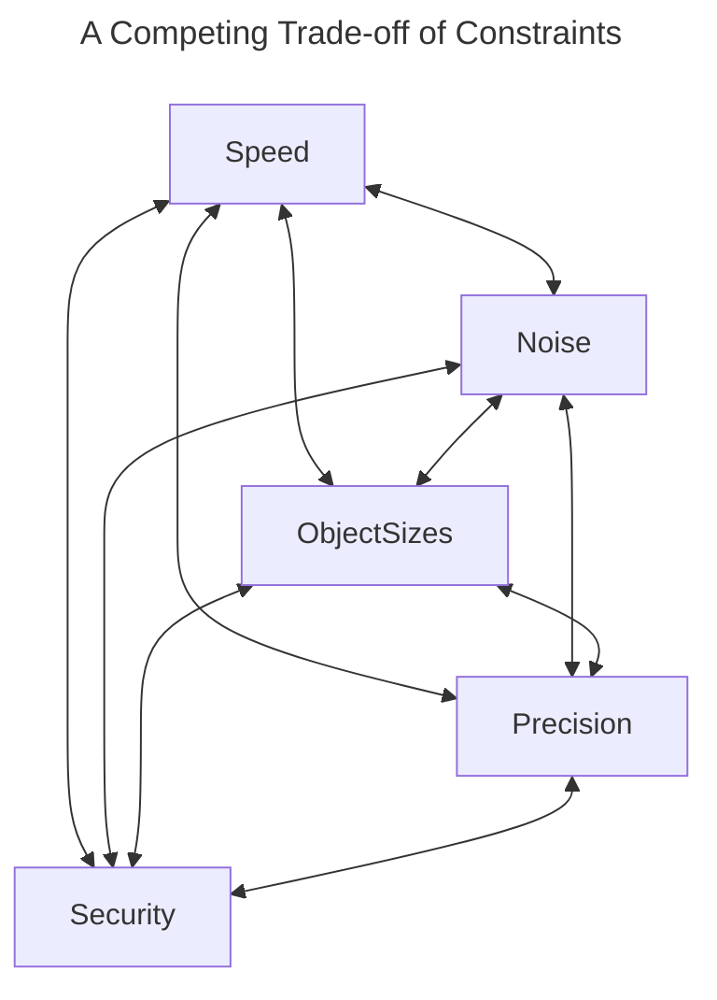

  <!-- Main header navigation -->

   
  <a href="https://fhe-org.github.io">Home</a> | <a href="https://fhe-org.github.io/resources"><b>Resources</b></a> | <a href="https://fhe-org.github.io/conferences/conference-2023/home">Conference 2023</a> | <a href="https://fhe-org.github.io/community">Join the community</a>

<!-- /Main header navigation -->

<!-- Resource categories links -->

  <a href="https://fhe-org.github.io/resources">Resources</a>
  —
  <a href="https://fhe-org.github.io/meetups">FHE.org meetups</a>
  —
  <a href="https://fhe-org.github.io/resources/libraries">Libraries</a>
  —
  <a href="https://fhe-org.github.io/resources/use-cases">Use cases</a>
  —
  <a href="https://fhe-org.github.io/resources/papers">Papers</a>
  —
  <a href="https://fhe-org.github.io/resources/schemes">Schemes</a>
  —
  <a href="https://fhe-org.github.io/resources/schemes"><b>Learn</b></a>

<!-- /Resource categories links -->

 
 

<table align=center>
<tr>
<td><a href="https://github.com/FHE-org/fhe-org.github.io/blob/carrotcypher-patch-1/resources/learn/developer/generalities.md">ᐊ Generalities</a></td>
<td>Learner Track: Developer - Constraints</td>
<td><a href="https://github.com/FHE-org/fhe-org.github.io/blob/carrotcypher-patch-1/resources/learn/developer/schemes-and-libraries.md">Schemes and Libraries ᐅ</a></td>
</tr>
</table>

 

# Learner Track: Developer 
This learner track assumes you are a developer wanting to learn about FHE. To see other available Learner Tracks, [click here](https://github.com/FHE-org/fhe-org.github.io/blob/carrotcypher-patch-1/resources/learn/readme.md).
 

# Constraints

There are several constraints regarding the implementation of homomorphic encryption-based solutions. Each of these constraints needs to be considered carefully when implementing an FHE-based solution. 

### Choosing Parameters

<table>
<tr>
<td colspan=1>
The target homomorphic encryption scheme needs to be initialized with parameters which are used throughout the computation. These parameters determine everything performance related: the security level, the efficiency of homomorphic operations, the size of key material, the input (and output) precision, how noise grows throughout the computation, and when a special operation called bootstrapping needs to be performed. We consider each of these issues below, one-by-one.
</tr>
</table>
 

## Approximate vs Exact computation

<table>
<tr>
<td colspan=2>
FHE schemes can be categorised in many ways. One of the most important distrinctions is whether an FHE scheme is <b>exact</b> or <b>approximate</b>. In the first case computations are typically considered over the integers and correctness of output is guaranteed. In the latter case, a small error is incurred during computation, so that the output of a homomorphic function evaluation, such as computing `f(x)`, contains a small error: `f(x) + e`.
</tr>
</table>
 

## Input Precision
<table>

<tr>
<td colspan=2>
FHE schemes typically work over restricted input domains (for example: the integers modulo `p`). This means that when implementing an algorithm in FHE, it is important to consider whether the algorithm needs to be adapted to work over this domain. As an example, consider the `max()` function on real numbers: suppose that we want to compute the max of 0.001 and 8.764. Certain FHE schemes work modulo `p` (as mentioned above), so the first step is to figure out how to map our inputs, and the respective max algorithm, into this modular domain.
</td>
</tr>

<tr>
<td>Further Reading</td>
<td>

- [Quantization](https://docs.zama.ai/concrete-ml/advanced-topics/quantization) by **Zama** in **2023**.

</td>
</tr>
</table>
 

## Output Precision
<table>
<tr>
<td colspan=2>
For approximate schemes, such as CKKS, the homomorphic encryption scheme carries an implicit error which impacts the message. The parameters can be adapted to guarantee a specific output precision, but this is important to note when considering implementing solutions in CKKS.</tr>

<tr>
<td>Further Reading</td>
<td>

- Part 2 of a [blog series on CKKS](https://blog.openmined.org/ckks-explained-part-2-ckks-encoding-and-decoding/) by **Daniel Huynh (OpenMined)** in **2020**.
- Introduction to CKKS (Approximate Homomorphic Encryption) [video](https://www.youtube.com/watch?v=iQlgeL64vfo) by **Yongsoo Song (SNU)** in **2020**.
</td>
</tr>
</table>
 

## Speed

<table>
<tr>
<td colspan=2>
The speed of FHE-based operations is constantly improving. However, there is still a large slow-down compared to plaintext operations, and it is important to consider this when getting started. There are a variety of open-soruce implementations of various algorithims implemented in FHE, and looking at benchmarks for these applications can give a good indication of where FHE is at.
<tr>
<td>Further Reading</td>
<td>

- [tfhe-rs benchmarks](https://docs.zama.ai/tfhe-rs/getting-started/benchmarks) by **Zama** in **2023**.
- Slide deck containing [HEAAN benchmarks](https://github.com/snucrypto/HEAAN/blob/master/slide-HEAAN.pdf) by **SNU** in **2018**.
- Demo paper containing [Lattigo benchmars](https://homomorphicencryption.org/wp-content/uploads/2020/12/wahc20_demo_christian.pdf) by **Mouchet et al.** in **2020**.
</td>
</tr>
</table>
 

## Object Sizes

<table>
<tr>
<td colspan=2>
When data is encrypted using an FHE scheme, there is an expansion factor which needs to be considered. As an example, in the TFHE scheme, to encrypt somewhere in the order of 1-8 bits, a ciphertext will be of size 5 kilobytes. Evaluation keys, which are required for the server to carry out homomorphic operations over ciphertexts, can be very large. In particular, all evaluation keys stored on the server are just collections of ciphertexts, and can be in the order of tens of megabytes (or even over a gigabyte, in certain cases). This means that there is a high bandwidth requirement on FHE-based solutions.
</table>
 

## Noise and Bootstrapping

<table>
<tr>
<td colspan=2>
As homomorphic operations are being computed, the level of noise contained in the utilised ciphertext grows. The noise level must not be allowed to overflow a specific bound, or errors can be introduced into computations. The process used to clear this noise is called bootstrapping, and, depending on the scheme, has a varying level of efficiency.
<tr>
<td>Further Reading</td>
<td>

- A [blogpost](https://www.zama.ai/post/what-is-bootstrapping-homomorphic-encryption) on bootstrapping by **Nigel Smart (Zama)** in **2023**.
- A [blogpost](https://dualitytech.com/blog/bootstrapping-in-fully-homomorphic-encryption-fhe/) on bootstrapping by **Yuriy Polyakov and Ahmad Al Badawi (Duality)** in **2023**.
</td>
</tr>
</table>
 

## Security

<table>
<tr>
<td colspan=2>
It is important that the homomorphic encryption scheme is parameterised correctly to ensure a sufficient level of security. The security is related a problem called Learning with Errors, and we need to choose cryptographic parameters such that this problem is hard to solve. Luckily, there are many FHE-based tools which take the problem of parameter selection away from the user. Moreover, most FHE libraries typically have default parameter sets for which the security level has already been determined.
<tr>
<td>Further Reading</td>
<td>
  
  - Wikipedia [page](https://en.wikipedia.org/wiki/Learning_with_errors) on the Learning with Errors problem. 
  - Stackexchange [answer](https://crypto.stackexchange.com/questions/47432/what-does-it-mean-the-security-parameter-for-a-fhe-scheme) to: What is a security parameter?
  - A [blogpost](https://www.zama.ai/post/estimating-the-security-of-homomorphic-schemes) on estimating the security of FHE schemes by **Zama** in **2021**.
  - Taking the problem out of the hands of the user: Zama’s [security curves implementation](https://github.com/zama-ai/concrete/tree/main/tools/parameter-curves) by **Zama** in **2023**.
</td>
</tr>
</table>
 

 
 

<table align=center>
<tr>
<td><a href="https://github.com/FHE-org/fhe-org.github.io/blob/carrotcypher-patch-1/resources/learn/developer/generalities.md">ᐊ Generalities</a></td>
<td>Learner Track: Developer - Constraints</td>
<td><a href="https://github.com/FHE-org/fhe-org.github.io/blob/carrotcypher-patch-1/resources/learn/developer/schemes-and-libraries.md">Schemes and Libraries ᐅ</a></td>
</tr>
</table>

 
 

<!--- Footer --->

💙 This website is a resource provided and contributed by the FHE.org community and is licensed under a <a rel="license" href="http://creativecommons.org/licenses/by-sa/4.0/">Creative Commons Attribution-ShareAlike 4.0 International License</a>. We welcome any contributions to this website! Read the <a href="https://fhe-org.github.io/contrib">contribution guidelines</a> first and simply open a PR on the <a href="https://github.com/fhe-org/fhe-org">Github repo</a> to add your resources.

