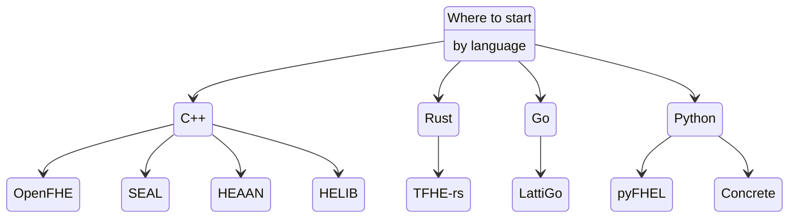
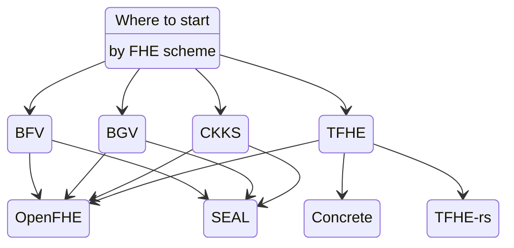

<!-- Main header navigation -->

   
  <a href="https://fhe-org.github.io">Home</a> | <a href="https://fhe-org.github.io/resources"><b>Resources</b></a> | <a href="https://fhe-org.github.io/conferences/conference-2023/home">Conference 2023</a> | <a href="https://fhe-org.github.io/community">Join the community</a>

<!-- /Main header navigation -->

<!-- Resource categories links -->

  <a href="https://fhe-org.github.io/resources">Resources</a>
  —
  <a href="https://fhe-org.github.io/meetups">FHE.org meetups</a>
  —
  <a href="https://fhe-org.github.io/resources/libraries">Libraries</a>
  —
  <a href="https://fhe-org.github.io/resources/use-cases">Use cases</a>
  —
  <a href="https://fhe-org.github.io/resources/papers">Papers</a>
  —
  <a href="https://fhe-org.github.io/resources/schemes">Schemes</a>
  —
  <a href="https://fhe-org.github.io/resources/learn"><b>Learner Track</b></a>

<!-- /Resource categories links -->

 
 

<table align=center>
<tr>
<td><a href="https://github.com/FHE-org/fhe-org.github.io/blob/carrotcypher-patch-1/resources/learn/developer/schemes-and-libraries.md">ᐊ Schemes and Libraries</a></td>
<td>Learner Track: Developer - Start Coding</td>
<td><a href="https://github.com/FHE-org/fhe-org.github.io/blob/carrotcypher-patch-1/resources/learn">Learner Track ᐅ</a></td>
</tr>
</table>

 

# Learner Track: Developer 
This learner track assumes you are a developer wanting to learn about FHE. To see other available Learner Tracks, [click here](https://github.com/FHE-org/fhe-org.github.io/blob/carrotcypher-patch-1/resources/learn/readme.md).
 

# Start Coding

The best way to get started in FHE is to look at Tutorials. In particular: trying to read them, understand the code, and then extend the examples with your own code.

Below is a list of all resources from Tutorials and Examples found on various libraries repositories and some diagram to let you pick
one library to start with. Note that every libraries have their own capabilities that are not covered here.

## Select an FHE library

### By Language

### By Scheme

## Tutorials

Here is a list of examples and tutorials from each libraries, with some keywords (prefixed with a #) to highlight the language, library, scheme and category they belong to.

### Concrete

- Table Lookup #Python #concrete #tfhe #tutorial
[view](https://docs.zama.ai/concrete/tutorials/table_lookups)
- Rounded Table Lookup #Python #concrete #tfhe #tutorial
[view](https://docs.zama.ai/concrete/tutorials/rounded_table_lookups)
- TFHE floating points #Python #concrete #tfhe #tutorial
[view](https://docs.zama.ai/concrete/tutorials/floating_points)
- Encrypted Key value database #Python #concrete #tfhe #application
[view](https://docs.zama.ai/concrete/tutorials/key_value_database)
- Client Server deployment #Python #concrete #tfhe #deployment
[view](https://docs.zama.ai/concrete/how-to/deploy)

### Lattigo

- A Privacy-Preserving yet Accountable Ride-Hailing Service #Go #lattigo #BFV #application
[view](https://github.com/tuneinsight/lattigo/blob/master/examples/bfv/main.go)
- CKKS Lookup Table #ckks #Go #lattigo #tutorial
[view](https://github.com/tuneinsight/lattigo/blob/master/examples/ckks/advanced/lut/main.go)
- CKKS Bootstrapping #ckks #Go #lattigo #tutorial
[view](https://github.com/tuneinsight/lattigo/blob/master/examples/ckks/bootstrapping/main.go)
- Euler #ckks #Go #lattigo #tutorial
[view](https://github.com/tuneinsight/lattigo/blob/master/examples/ckks/euler/main.go)
- Function evaluation #ckks #Go #lattigo #tutorial
[view](https://github.com/tuneinsight/lattigo/blob/master/examples/ckks/polyeval/main.go)
- Private Information Retrieval example #bfv #Go #lattigo #application
[view](https://github.com/tuneinsight/lattigo/blob/master/examples/dbfv/pir/main.go)
- Private Set intersection example #bfv #Go #lattigo #application
[view](https://github.com/tuneinsight/lattigo/blob/master/examples/dbfv/psi/main.go)
- TFHE Lookup Table #tfhe #Go #lattigo #tutorial
[view](https://github.com/tuneinsight/lattigo/blob/master/examples/rgsw/main.go)
- Vectorized oblivious evaluation #Go #lattigo #application
[view](https://github.com/tuneinsight/lattigo/blob/master/examples/ring/vOLE/main.go)

### HEAAN

- Get started #C++ #HEAAN #ckks # tutorial
[view](https://github.com/snucrypto/HEAAN/blob/master/README.md)

### HELIB

- CKKS basics #C++ #HELIB #ckks #tutorial
[view](https://github.com/homenc/HElib/blob/master/examples/tutorial/01_ckks_basics.cpp)
- CKKS depth #C++ #HELIB #ckks #tutorial
[view](https://github.com/homenc/HElib/blob/master/examples/tutorial/02_ckks_depth.cpp)
- CKKS data movement #C++ #HELIB #ckks #tutorial
[view](https://github.com/homenc/HElib/blob/master/examples/tutorial/03_ckks_data_movement.cpp)
- CKKS matrix multiplication #C++ #HELIB #ckks #tutorial
[view](https://github.com/homenc/HElib/blob/master/examples/tutorial/04_ckks_matmul.cpp)
- CKKS multiplication #C++ #HELIB #ckks #tutorial
[view](https://github.com/homenc/HElib/blob/master/examples/tutorial/05_ckks_multlowlvl.cpp)
- CKKS serialization #C++ #HELIB #ckks #tutorial
[view](https://github.com/homenc/HElib/blob/master/examples/tutorial/07_ckks_serialization.cpp)
- CKKS deserialization #C++ #HELIB #ckks #tutorial
[view](https://github.com/homenc/HElib/blob/master/examples/tutorial/08_ckks_deserialization.cpp)
- BGV Binary arithmetic #C++ #HELIB #bgv #tutorial
[view](https://github.com/homenc/HElib/blob/master/examples/BGV_binary_arithmetic/BGV_binary_arithmetic.cpp)
- Privacy Preserving search against an encrypted database / Country lookup #C++ #HELIB #bgv #application
[view](https://github.com/homenc/HElib/blob/master/examples/BGV_country_db_lookup/README.md)
- BGV Packed arithmetic #C++ #HELIB #bgv #tutorial
[view](https://github.com/homenc/HElib/blob/master/examples/BGV_packed_arithmetic/BGV_packed_arithmetic.cpp)

### OpenFHE

- FHE for arithmetic over integers #C++ #openfhe #bfv #tutorial
[view](https://github.com/openfheorg/openfhe-development/blob/main/src/pke/examples/simple-integers.cpp)
- FHE for arithmetic over integers #C++ #openfhe #bgv #tutorial
[view](https://github.com/openfheorg/openfhe-development/blob/main/src/pke/examples/simple-integers-serial-bgvrns.cpp)
- FHE for arithmetic over real numbers #C++ #openfhe #ckks #tutorial
[view](https://github.com/openfheorg/openfhe-development/blob/main/src/pke/examples/simple-real-numbers.cpp)
- advanced arithmetic over real numbers #C++ #openfhe #ckks #tutorial
[view](https://github.com/openfheorg/openfhe-development/blob/main/src/pke/examples/advanced-real-numbers.cpp)
[next](https://github.com/openfheorg/openfhe-development/blob/main/src/pke/examples/advanced-real-numbers-128.cpp)
- Arbitrary Smooth Function Evaluation #C++ #openfhe #ckks #tutorial
[view](https://github.com/openfheorg/openfhe-development/blob/main/src/pke/examples/function-evaluation.cpp)
- Simple CKKS Bootstrapping Example #C++ #openfhe #ckks #tutorial
[view](https://github.com/openfheorg/openfhe-development/blob/main/src/pke/examples/simple-ckks-bootstrapping.cpp)
- Advanced CKKS Bootstrapping Example #C++ #openfhe #ckks #tutorial
[view](https://github.com/openfheorg/openfhe-development/blob/main/src/pke/examples/advanced-ckks-bootstrapping.cpp)
- Double-Precision (Iterative) Bootstrapping Example #C++ #openfhe #ckks #tutorial
[view](https://github.com/openfheorg/openfhe-development/blob/main/src/pke/examples/iterative-ckks-bootstrapping.cpp)
- FHE for Boolean circuits and larger plaintext spaces #C++ #openfhe #tfhe #tutorial
[view](https://github.com/openfheorg/openfhe-development/blob/main/src/binfhe/examples/boolean.cpp)
[next](https://github.com/openfheorg/openfhe-development/blob/main/src/binfhe/examples/boolean-serial-json.cpp)
[next](https://github.com/openfheorg/openfhe-development/blob/main/src/binfhe/examples/boolean-serial-binary.cpp)
- Large-Precision Comparison #C++ #openfhe #tfhe #tutorial
[view](https://github.com/openfheorg/openfhe-development/blob/main/src/binfhe/examples/eval-sign.cpp)
- Small-Precison Arbitrary Function Evaluation #C++ #openfhe #tfhe #tutorial
[view](https://github.com/openfheorg/openfhe-development/blob/main/src/binfhe/examples/eval-function.cpp)
- Threshold FHE #C++ #openfhe #threshold #bgv #bfv #ckks #tutorial
[view](https://github.com/openfheorg/openfhe-development/blob/main/src/pke/examples/threshold-fhe.cpp)
- Threshold FHE with 5 parties #C++ #openfhe #threshold #bfv #tutorial
[view](https://github.com/openfheorg/openfhe-development/blob/main/src/pke/examples/threshold-fhe-5p.cpp)

### PyFHEL

- Integer Demo with BFV #python #PyFHEL #bfv #tutorial
[view](https://github.com/ibarrond/Pyfhel/blob/master/examples/Demo_2_Integer_BFV.py)
- Fixed-point FHE with CKKS scheme #python #PyFHEL #bfv #tutorial
[view](https://github.com/ibarrond/Pyfhel/blob/master/examples/Demo_3_Float_CKKS.py)
- Saving and Restoring objects #python #PyFHEL #tutorial
[view](https://github.com/ibarrond/Pyfhel/blob/master/examples/Demo_4_SaveNRestore.py)
- Client/Server demo #python #PyFHEL #deployment
[view](https://github.com/ibarrond/Pyfhel/blob/master/examples/Demo_5_CS_Client.py)
- Multiplication Depth with Integers and Noise budget #python #PyFHEL #bfv #ckks #tutorial
[view](https://github.com/ibarrond/Pyfhel/blob/master/examples/Demo_6_MultDepth.py)
- Scalar product #python #PyFHEL #bfv #ckks #tutorial
[view](https://github.com/ibarrond/Pyfhel/blob/master/examples/Demo_6_MultDepth.py)
- Hamming distance #python #pyFHEL #bfv #application
[view](https://github.com/ibarrond/Pyfhel/blob/master/examples/Demo_8_HammingDist.py)

### SEAL

- Encrypted modular arithmetic using the BFV scheme #C++ #Seal #bfv #tutorial
[view](https://github.com/microsoft/SEAL/blob/main/native/examples/1_bfv_basics.cpp)
- Encoding more complex data into Microsoft SEAL plaintext objects #C++ #Seal #tutorial
[view](https://github.com/microsoft/SEAL/blob/main/native/examples/2_encoders.cpp)
- Introduces the concept of levels; prerequisite for using the CKKS scheme #C++ #Seal #ckks #tutorial
[view](https://github.com/microsoft/SEAL/blob/main/native/examples/3_levels.cpp)
- Encrypted modular arithmetic using the BGV scheme #C++ #Seal #bgv #tutorial
[view](https://github.com/microsoft/SEAL/blob/main/native/examples/4_bgv_basics.cpp)
- Encrypted real number arithmetic using the CKKS scheme #C++ #Seal #ckks #tutorial
[view](https://github.com/microsoft/SEAL/blob/main/native/examples/5_ckks_basics.cpp)
- Performing cyclic rotations on encrypted vectors in the BFV and CKKS schemes #C++ #Seal #bfv #ckks #tutorial
[view](https://github.com/microsoft/SEAL/blob/main/native/examples/6_rotation.cpp)
- Serializing objects in Microsoft SEAL #C++ #Seal #tutorial
[view](https://github.com/microsoft/SEAL/blob/main/native/examples/7_serialization.cpp)
- Performance tests #C++ #Seal #benchmark
[view](https://github.com/microsoft/SEAL/blob/main/native/examples/8_performance.cpp)

### TFHE-rs

- Integers operations #Rust #tfhe-rs #tfhe #tutorial
[view](https://docs.zama.ai/tfhe-rs/high-level-api/tutorial)
- Integer Serialization/Deserialization
[view](https://docs.zama.ai/tfhe-rs/high-level-api/serialization)
- Boolean operations #Rust #tfhe-rs #tfhe #tutorial
[view](https://docs.zama.ai/tfhe-rs/boolean/tutorial)
- Boolean serialization #Rust #tfhe-rs #tfhe #tutorial
[view](https://docs.zama.ai/tfhe-rs/boolean/serialization)
- C-API #C #tfhe-rs #tfhe #tutorial
[view](https://docs.zama.ai/tfhe-rs/c-api/high-level-api)
- C-API #JS #tfhe-rs #tfhe #tutorial
[view](https://docs.zama.ai/tfhe-rs/js-on-wasm-api/tutorial)
- FHE SHA256 #Rust #tfhe-rs #tfhe #tutorial
[view](https://github.com/zama-ai/tfhe-rs/blob/main/tfhe/docs/tutorial/sha256_bool.md)
- Encrypted Regular Expression engine #Rust #tfhe-rs #tfhe #application
[view](https://github.com/zama-ai/tfhe-rs/blob/main/tfhe/docs/tutorial/regex/tutorial.md)
- Dark Market in FHE #Rust #tfhe-rs #tfhe #application
[view](https://github.com/zama-ai/tfhe-rs/blob/main/tfhe/docs/tutorial/dark_market.md)

 
 

<table align=center>
<tr>
<td><a href="https://github.com/FHE-org/fhe-org.github.io/blob/carrotcypher-patch-1/resources/learn/developer/schemes-and-libraries.md">ᐊ Schemes and Libraries</a></td>
<td>Learner Track: Developer - Start Coding</td>
<td><a href="https://github.com/FHE-org/fhe-org.github.io/blob/carrotcypher-patch-1/resources/learn">Learner Track ᐅ</a></td>
</tr>
</table>

 
 

<!--- Footer --->

💙 This website is a resource provided and contributed by the FHE.org community and is licensed under a <a rel="license" href="http://creativecommons.org/licenses/by-sa/4.0/">Creative Commons Attribution-ShareAlike 4.0 International License</a>. We welcome any contributions to this website! Read the <a href="https://fhe-org.github.io/contrib">contribution guidelines</a> first and simply open a PR on the <a href="https://github.com/fhe-org/fhe-org">Github repo</a> to add your resources.
